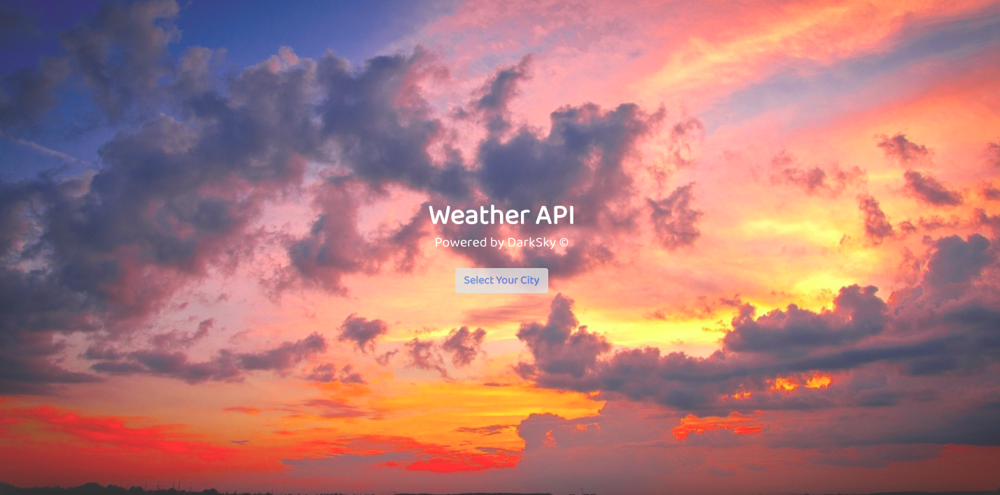
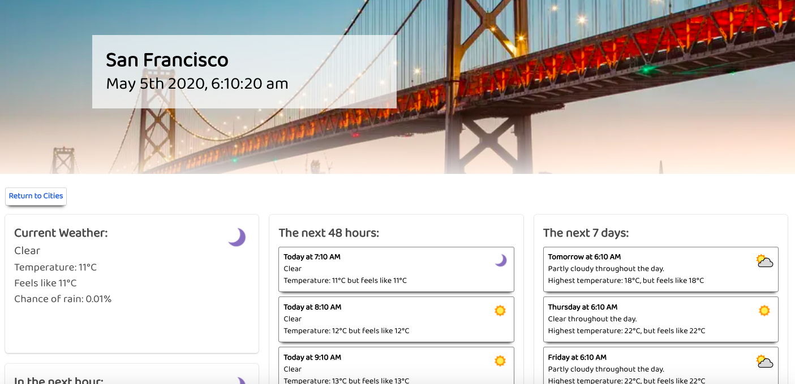

###  General Assembly, Software Engineering Immersive

# project-2
# Weather API

by [Emma Hobday](https://github.com/emmahobday) and [Tom Bannister](https://github.com/tombannister01)


## Overview

This was a two-day paired project as part of the Software Engineering Immersive course at General Assembly London. The assignment was to build a React application that consumes a public API.

We chose to create a weather forecasting app, using DarkSky API. You can view the app on GitHub pages [here](https://emmahobday.github.io/project-2/), and find the GitHub repo [here](https://github.com/emmahobday/project-2).

## Brief

* Consume a public API
* Have several components - at least one classical and one functional
* The app should include a router with several 'pages'
* Stick with KISS (Keep It Simple Stupid) and DRY (Don't Repeat Yourself) principles
* Be deployed online and accessible to the public
* Have semantically clean HTML

## Technologies used
* HTML5
* React
* CSS3
* JavaScript (ES6)
* Git and GitHub
* Google Fonts
* NPM


## Approach

Our vision was to create a beautiful app that would display weather information for cities around the world. We selected DarkSky API because the data it provided was so detailed - using it, we could display forecast infomation for the next minute, hour, or day. We used Bulma to style our app.

### Router

We used `<BrowserRouter>` to create the routing.

```
import { BrowserRouter, Switch, Route } from 'react-router-dom'

const App = () => {
  return <BrowserRouter basename="/project-2">
    <Switch>
      <Route exact path="/cities/:city" component={SingleCity} />
      <Route exact path="/cities" component={Cities} />
      <Route exact path="/" component={Home} />
    </Switch>
  </BrowserRouter>
}
```


Our site has three main components: a homepage, a 'cities' page where you can select your city, and a 'single city' page which displays information for the selected city.

### Homepage

Our homepage is simple yet striking, using a full height Bulma Hero banner, with a link to our 'cities' page. We selected a free sunset image to make our page eye-catching and inviting.




### Cities

Our 'cities' page displays twelve cards with the name and image of twelve main cities. 

We used a classical component with data for these cities hard-coded into the state. We made the decision to hard-code this data for a number of reasons: DarkSky API doesn't provide images for cities, and at this point no forecast information was required from the API. We included the latitude and longitude of these cities in our state, as this will be needed to fetch the forecast data from the API on click. 

```
this.state = {
      cityInfo: {
        cityArray: [
          { name: 'London', latlong: '51.507351,-0.127758', image: 'https://cdn.londonandpartners.com/assets/73295-640x360-london-skyline-ns.jpg' },
          { name: 'San Francisco', latlong: '37.774929,-122.419418', image: 'https://static.independent.co.uk/s3fs-public/thumbnails/image/2019/09/16/15/san-francisco.jpg?w968h681' },
          { name: 'New York', latlong: '40.712776,-74.005974', image: 'https://www.gannett-cdn.com/media/2018/12/15/USATODAY/usatsports/MotleyFool-TMOT-657f0436-21e9af86.jpg' },
          { name: 'Paris', latlong: '48.856613,-2.352222', image: 'https://images.pexels.com/photos/338515/pexels-photo-338515.jpeg?auto=compress&cs=tinysrgb&dpr=1&w=500' },
          { name: 'Berlin', latlong: '52.520008,13.404954', image: 'https://media.timeout.com/images/105303515/630/472/image.jpg' },
          { name: 'Milan', latlong: '45.464664,9.188540', image: 'https://specials-images.forbesimg.com/imageserve/493223692/960x0.jpg?fit=scale' },
          { name: 'Sydney', latlong: '33.8688,151.2093', image: 'https://images.unsplash.com/photo-1524293581917-878a6d017c71?ixlib=rb-1.2.1&ixid=eyJhcHBfaWQiOjEyMDd9&w=1000&q=80' },
          { name: 'Beijing', latlong: '39.9042,116.4074', image: 'https://www.omm.com/~/media/images/site/locations/beijing_780x520px.ashx' },
          { name: 'Tokyo', latlong: '35.6762,139.6503', image: 'https://www.telegraph.co.uk/content/dam/Travel/Destinations/Asia/Japan/Tokyo/tokyo-guide-shopping-lead.jpg' },
          { name: 'Dubai', latlong: '25.2048,55.2708', image: 'https://images.musement.com/cover/0002/45/dubai-skyline-at-dusk-jpg_header-144981.jpeg' },
          { name: 'Mexico City', latlong: '19.4326,99.1332', image: 'https://nomadlist.com/assets/img/cities/mexico-city-mexico-500px.jpg' },
          { name: 'Buenos Aires', latlong: '34.6037,58.3816', image: 'https://lp-cms-production.imgix.net/2019-06/4c410251e0146b2edd2b8b1d64a02047-buenos-aires.jpg?fit=crop&q=40&sharp=10&vib=20&auto=format&ixlib=react-8.6.4' }
        ]
      }
    }
```

We laid out the page using a medium-height hero banner, using the same background image as the homepage for continuity, and Bulma cards to display an image and title of each city. Each card has the hard-coded data from the state passed down upon click, using a 'Link' from the react-router-dom.

`import { Link } from 'react-router-dom'`


```
            {this.state.cityInfo.cityArray.map((city, key) => {
              return <div className="column is-one-third" key={key}>
                <Link
                  to={{
                    pathname: `cities/${city.name}`,
                    state: { city } 
                  }}
                >
                  <div className="card">
                    <div className="card-image ">
                      <figure className="image is-4by3">
                        
                      </figure>
                    </div>
                    <div className="card-content">
                      <h2 className="subtitle">{city.name}</h2>
                    </div>
                  </div>
                </Link>
              </div>
            })}
```


### Single City 
Our 'single city' page uses another classical component. We used the life cycle method componentDidMount to fetch the data from DarkSky using Axios when the page loads. DarkSky requires the latitude and longitude of a city to make the request, which we had hard-coded into our state on the Cities page. This data is passed through as props when the city is selected, and set as a variable when the page loads:

`const data = this.props.location.state`

Initially we had a CORS issue which prevented us from retrieving the data, which we solved by using CORS Anywhere from Heroku to add CORS headers to the proxied request. 

```
componentDidMount() {
    const data = this.props.location.state
    axios.get(`https://cors-anywhere.herokuapp.com/https://api.darksky.net/forecast/b5ed109d2c55c56135ed4fc656a0f25c/${data.city.latlong}`)
      .then(res => {
        this.setState({ forecast: res.data })
      })
      .catch(err => console.error(err))
  }
```

When the page renders, a medium sized Bulma Hero banner is positioned at the top of the page, with a background image and city name passed through as props from the Bulma card that was clicked. 

```
<div className="hero-body single-city-background" style={{ backgroundImage: `url(${this.props.location.state.city.image})` }}>
```

We also included a clock displaying local time in the selected city using moment.js - we have detailed this in the section 'running a local-time clock' below.

We also included a button linking back to the 'city' page to allow the user to navigate our app easily.

We used Bulma tiles to lay out the forecast information in a visually appealing way. The temperature data provided by DarkSky is in Fahrenheit, so we converted it to Celsius and rounded it to the nearest whole number. 

`<p className="summary-box">Temperature: {Math.round(((forecast.currently.temperature) - 32) * (5 / 9))}°C</p>
`

DarkSky provides an icon in the form of a descriptor (e.g. 'clear-day') which we used to retrieve an image from darksky.net.

```

```

Our largest Bulma tile displays an hour-by-hour forecast for the coming 48 hours. We used the local time generated by Moment Timezone from moment.js to display the time it will be at each of these times; we did this by setting a variable 'counter' at 0 within our render function, adding 1 to the counter with each piece of data mapped, and adding this many hours to the local time. 

`let counter = 0`

```<p className="hourly-forecast">{moment().tz(`${this.state.forecast.timezone}`).add(counter += 1, 'hour').calendar()}</p>```

We then added a scroll function to our SCSS styling, and a subtle animation on hover.

```
.daily {
	overflow: hidden scroll;
}
```
```
.btn:hover{
   box-shadow:0px 10px 10px rgba(0,0,0,0.2);
   transform : translateY(-3px);
}
```

We wanted to include a 'fade' at the bottom of our single city Hero banner - a task that proved less straightforward than it initially sounded. We didn't want to edit the original images as they are used without the fade on the tiles on the 'Cities' component. Our solution was to create a div element underneath our Hero banner, set its position to 'absolute' and set a linear gradient from transparent to white from top to bottom. 

```
div.fade {
  height: 160px;
  width: 100%;
  position: absolute;
  align-self: flex-end;
  background-image: linear-gradient(180deg, transparent, white);
}
```



## Running a local-time clock

We decided to implement a working clock on each single city page and configure it to each timezone depending on the city that the user had clicked. We did this using a Javascript library called Moment.js and Moment Timezone.

We put the currentDate in our State as 
`currentDate: '',`,
and put a setInterval inside componentDidMount which updated the empty string with the local time of the city clicked every second. The timezone for the selected city was taken from the data retrieved from DarkSky API.

```
setInterval(() => {
          this.setState({ currentDate: moment().tz(`${this.state.forecast.timezone}`).format('MMMM Do YYYY, h:mm:ss a') })
        }, 1000)
```
Initially we had an issue where the 'ticking' time failed when the user selected a second page because the time had continued to update once the user navigated away from the page. We solved this by stopping the setInterval in the lifecycle method componentWillUnmount:

`
  componentWillUnmount() {
    clearInterval(this.state.intervalID)
  }
  `


## Successes

We examined the API documentation and data really carefully before we started building. This meant we were able to design pages that could be achieved efficiently, and utilised plenty of the available data. For example, DarkSky API provides forecast data in four categories: currently, minutely, hourly and daily. We used data from all four categories, and decided exactly which fields we'd need on each page prior to writing any code. This meant that we were able to have a minimum viable product finished on the first day.

We decided to use Bulma for styling, and this meant that we were able to achieve a professional look for our pages very quickly - perfect for a 48 hour hackathon! 

It was our first experience of paired programming, and we found it really enjoyable and motivating to problem-solve together. We feel very proud of what we achieved together in just 48 hours.


## Lessons Learned

We underestimated how long it would take to get a clock ticking in local time on each single city page - a task that ended up taking almost the entire second day. We knew that moment.js included the functionality to make this achieveable, but debugging the myriad of issues we encountered took the majority of our project time. Through this, we learned a lot about React life cycle methods and how state is updated.


